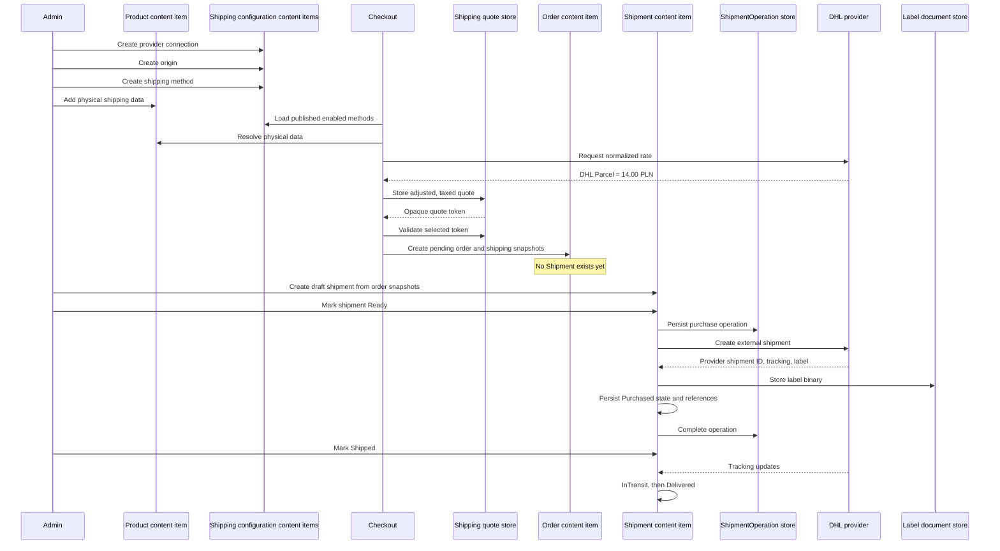

# OrchardCore Commerce Shipping — Simple Order and Shipment Lifecycle

- **Status:** Implementation walkthrough
- **Based on:** `OrchardCore-Commerce-Shipping-Design.md`, version 2.3
- **Document version:** 1.2
- **Date:** 2026-07-19
- **Primary module:** `OrchardCore.Commerce.Shipping`

> This companion document explains, step by step, what is configured, created, stored, updated, and sent to a shipping provider for one simple physical order. It intentionally uses a single origin, one direct carrier integration, one shipping method, one package, one order, and one shipment.

---

## 1. Purpose

The design specification defines the architecture and public contracts. This walkthrough answers the operational questions that usually arise during implementation:

- Which Orchard content types exist before checkout?
- Which records are transient and which are permanent?
- What values are copied into the order?
- When is a `Shipment` content item created?
- When is an external carrier shipment purchased?
- Which existing records are updated rather than recreated?
- What data remains authoritative after merchant configuration changes?
- Where capability validation, connection health, rate limits, layered fingerprints, tax resolution, and shipment-state validation occur?

The main rule is:

```text
Merchant configuration exists before checkout.
A temporary ShippingQuote exists during checkout.
An Order content item is created when checkout is submitted.
A Shipment content item is created only for fulfillment.
The external carrier shipment is purchased after the order exists.
```

---

## 2. Example scenario

This document uses the following illustrative order.

### 2.1 Store

```text
Store: Example Fashion Store
Tenant: Default
Currency: PLN
Origin: Kraków, Poland
Shipping tax rate used in this example: 23%
```

### 2.2 Shipping integration

```text
Shipping provider: DHL integration module
ProviderKey: Dhl
Provider connection: DHL Poland Production
Carrier: DHL
Service: DHL Parcel
ServiceCode: DHL_PARCEL
```

This is a direct carrier integration, so the shipping provider and carrier both refer to DHL. With an aggregator, they could differ, for example:

```text
ProviderKey: Sendcloud
CarrierCode: Dhl
ServiceCode: DHL_PARCEL_CONNECT
```

### 2.3 Product and cart

```text
Product: Classic T-Shirt, Black, Medium
SKU: TSHIRT-BLK-M
Quantity: 2
Unit product price: 80.00 PLN
Unit weight: 0.25 kg
Unit dimensions: 30 × 20 × 2 cm
Ships separately: false
```

### 2.4 Destination

```text
Customer: Anna Kowalska
Address: Marszałkowska 10, 00-590 Warszawa, PL
Phone: +48 500 000 000
Email: anna@example.test
```

### 2.5 Shipping price

```text
Raw DHL provider rate:              14.00 PLN
Merchant handling adjustment:       2.00 PLN
Shipping net amount:                16.00 PLN
Shipping tax at 23%:                 3.68 PLN
Shipping gross amount:              19.68 PLN
```

All identifiers shown below are shortened, readable examples. Production content-item IDs and generated identifiers should use the normal Orchard Core ID generator.

---

## 3. Record categories

Not everything in the shipping process is a content item.

| Category | Examples | Persistence |
|---|---|---|
| Orchard content items | `ShippingProviderConnection`, `ShippingOrigin`, `ShippingMethod`, `Order`, `Shipment` | YesSql content storage |
| Existing content extended by a part | Product or variant with `ShippingProductPart`; Order with `ShippingOrderPart` | Stored with the containing content item |
| Tenant settings | Standard store boxes and shipping module options | Tenant settings/configuration |
| Temporary checkout records | `ShippingQuote` | Short-lived quote store/cache |
| Normalized runtime DTOs | `ProviderRateRequest`, `ProviderShippingRate`, packed package result | Not independently persisted unless snapshotted |
| Durable operational records | `ShipmentOperation`, tracking events, webhook deduplication | Separate YesSql documents/tables |
| Binary artifacts | PDF/ZPL shipping labels | `IShippingDocumentStore`; only references live on the shipment |
| Nested order values | `OrderAdditionalCost`, order-line records, selected shipping snapshot | Stored inside the `Order` content item |

---

## 4. High-level sequence



---

# Part I — Merchant configuration before checkout

## 5. Step 1 — Enable the core shipping and DHL features

The tenant enables:

```text
OrchardCore.Commerce.Shipping
OrchardCore.Commerce.Shipping.Dhl
```

### Created in the system

No business content item is created. The features register content definitions, migrations, services, indexes, admin screens, and provider implementations.

The provider registry resolves and validates:

```yaml
ProviderKey: Dhl
Implementation: DhlShippingProvider
ImplementationVersion: "1"
DeclaredCapabilities:
  - Rates
  - ServiceDiscovery
  - ShipmentCreation
  - ShipmentCancellation
  - Labels
  - Tracking
  - Webhooks
  - Reconciliation
ImplementedInterfaces:
  - IShippingRateProvider
  - IShippingServiceCatalogProvider
  - IShipmentProvider
  - IShippingLabelProvider
  - IShippingTrackingProvider
  - IShippingWebhookHandler
  - IShipmentReconciliationProvider
CapabilityValidation: Valid
```

The descriptor supports early UI/configuration validation. Runtime execution still resolves the corresponding interface. A descriptor/interface mismatch prevents the provider from becoming active.

The shipping provider is installed code, not a content item.

## 6. Step 2 — Create the provider connection

The merchant creates and publishes one `ShippingProviderConnection` content item.

### Content type

```text
ShippingProviderConnection
 ├─ TitlePart
 └─ ShippingProviderConnectionPart
```

### Example values

```yaml
ContentItemId: conn-dhl-pl-prod
ContentType: ShippingProviderConnection
DisplayText: DHL Poland Production
Published: true
Latest: true

TitlePart:
  Title: DHL Poland Production

ShippingProviderConnectionPart:
  Enabled: true
  ProviderKey: Dhl
  Environment: Production
  CredentialReference: shipping/dhl/pl-production
  CredentialVersion: 1
  CredentialLastRotatedUtc: 2026-07-01T08:00:00Z
  CredentialRotationRequired: false
  ConfigurationRevision: 1
  Configuration:
    Type: DhlConnectionOptions
    Version: 1
    Settings:
      AccountNumber: "123456789"
      ApiBaseProfile: Poland
      DefaultLabelFormat: Pdf
```

### Secret store entry

```yaml
Key: shipping/dhl/pl-production
ActiveVersion: 1
ActivatedUtc: 2026-07-01T08:00:00Z
Values:
  ApiKey: protected-secret
  ApiSecret: protected-secret
```

The connection content item stores secret-reference metadata only. Secret values are never copied into quotes, orders, shipments, logs, operation records, or cache fingerprints.

### Connection health record

A separate transient record is created after a test or background check:

```yaml
ProviderConnectionContentItemId: conn-dhl-pl-prod
Status: Healthy
IsHealthy: true
CheckedUtc: 2026-07-20T09:55:00Z
ExpiresUtc: 2026-07-20T10:10:00Z
SafeMessage: null
```

A missing or disabled secret makes the connection unhealthy. It suppresses this connection's methods without suppressing other providers. Sandbox and production use separate connection content items.

## 7. Step 3 — Create the shipping origin

The merchant creates and publishes one `ShippingOrigin` content item.

### Content type

```text
ShippingOrigin
 ├─ TitlePart
 └─ ShippingOriginPart
```

### Example values

```yaml
ContentItemId: origin-krakow-main
ContentType: ShippingOrigin
DisplayText: Kraków Main Warehouse
Published: true
Latest: true

TitlePart:
  Title: Kraków Main Warehouse

ShippingOriginPart:
  Enabled: true
  ConfigurationRevision: 1
  Address:
    Company: Example Fashion Store Sp. z o.o.
    AddressLine1: Magazynowa 1
    City: Kraków
    PostalCode: 30-001
    CountryCode: PL
  ContactName: Warehouse Team
  Company: Example Fashion Store Sp. z o.o.
  Phone: "+48 12 000 00 00"
  Email: warehouse@example.test
  PackageTypeCodes:
    - BOX_S
    - BOX_M
    - BOX_L
```

The address and contact data used for the accepted checkout quote are later copied into the order. Fulfillment does not depend on the current origin content item remaining unchanged.

---

## 8. Step 4 — Configure standard store boxes

In version 2.3, `ShippingPackageType` is tenant settings data for the MVP, not a content type.

### Example settings

```yaml
PackageTypes:
  - Code: BOX_S
    DisplayText: Small box
    Enabled: true
    SortOrder: 10
    InnerDimensions:
      LengthCm: 35.0
      WidthCm: 25.0
      HeightCm: 8.0
    OuterDimensions:
      LengthCm: 36.0
      WidthCm: 26.0
      HeightCm: 9.0
    EmptyWeightKg: 0.15
    MaximumWeightKg: 5.00

  - Code: BOX_M
    DisplayText: Medium box
    Enabled: true
    SortOrder: 20
    InnerDimensions:
      LengthCm: 45.0
      WidthCm: 35.0
      HeightCm: 20.0
    OuterDimensions:
      LengthCm: 46.0
      WidthCm: 36.0
      HeightCm: 21.0
    EmptyWeightKg: 0.30
    MaximumWeightKg: 15.00
```

### Created in the system

No Orchard content item is created. The settings are loaded together by the packer.

The selected package used for rating or fulfillment is later snapshotted with actual dimensions and weight. Editing `BOX_S` does not change an existing quote, order, or shipment.

## 9. Step 5 — Create the shipping method

The merchant creates and publishes a `ShippingMethod` content item.

### Content type

```text
ShippingMethod
 ├─ TitlePart
 └─ ShippingMethodPart
```

### Example values

```yaml
ContentItemId: method-standard-delivery
ContentType: ShippingMethod
DisplayText: Standard delivery
Published: true
Latest: true

TitlePart:
  Title: Standard delivery

ShippingMethodPart:
  Enabled: true
  ProviderConnectionContentItemId: conn-dhl-pl-prod
  OriginContentItemId: origin-krakow-main
  AllowProductOriginOverride: false
  CarrierCode: DHL
  ServiceCode: DHL_PARCEL
  PackerKey: SinglePackage
  SortOrder: 10
  QuoteLifetimeSeconds: 300
  QuoteValidationMode: RequoteOnSubmit
  PolicyRevision: 1
  ProviderRateOptions:
    Type: DhlRateOptions
    Version: 1
    Settings:
      SaturdayDelivery: false
  Conditions:
    - Type: GeographicCondition
      Version: 1
      Settings:
        AllowedCountryCodes: [PL]
        ExcludedAdministrativeAreas: []
        PostalCodeRules:
          - MatchType: Prefix
            Value: "00"

    - Type: ScheduleCondition
      Version: 1
      Settings:
        TimeZone: Europe/Warsaw
        AllowedDays: [Monday, Tuesday, Wednesday, Thursday, Friday]
        CutoffTime: "16:00"
        StartDate: null
        EndDate: null
        ExcludedDates: []
  Adjustments:
    - Type: FixedAmountAdjustment
      Version: 1
      Settings:
        Amount: 2.00
        Currency: PLN
        Description: Handling fee
```

### Dependency references

```text
ShippingMethod
 ├─ references ProviderConnection: conn-dhl-pl-prod
 ├─ resolves effective Origin: origin-krakow-main
 ├─ selects Carrier: DHL
 ├─ selects Service: DHL_PARCEL
 └─ selects Packer: SinglePackage
```

The method title becomes `ShippingDisplayInfo.CustomerLabel`. Carrier and provider-service labels are optional external labels retained for administration/history.

For the example destination `00-590`, the country-aware normalizer removes the formatting hyphen and produces `00590`. The `Prefix` rule value `00` matches the beginning of that complete normalized value. The rule is not a regular expression. Other supported modes are `Exact`, `Range`, and a single-placeholder `Wildcard`.

If product-origin overrides are enabled later, every shippable line must resolve to the same origin in Phase 1; otherwise the method is unavailable with `MultipleOriginsNotSupported`.

## 10. Step 6 — Add shipping data to the product or variant

The existing commerce product or purchasable variant receives `ShippingProductPart`.

### Existing content type

The exact product/variant content type is owned by OrchardCore Commerce and the store. The shipping module adds:

```text
Product or Variant
 └─ ShippingProductPart
```

### Example values

```yaml
ContentItemId: product-tshirt-black-m
DisplayText: Classic T-Shirt — Black / M
SKU: TSHIRT-BLK-M

ShippingProductPart:
  IsShippable: true
  Weight: 0.25
  WeightUnit: Kilogram
  Length: 300
  Width: 200
  Height: 20
  DimensionUnit: Millimeter
  ShippingClass: Apparel
  ShipsSeparately: false
  IsHazardous: false
  CountryOfOrigin: PL
  HarmonizedSystemCode: "610910"
  PreferredShippingOriginContentItemId: null
```

No order or shipment exists at this point.

---

# Part II — Checkout and order creation

## 11. Step 7 — Customer creates a cart

The customer adds two units of the T-shirt to the cart.

### Cart line input

```yaml
CartId: cart-10001
Currency: PLN
Lines:
  - CartLineId: cart-line-1
    ProductContentItemId: product-tshirt-black-m
    SKU: TSHIRT-BLK-M
    Quantity: 2
    UnitPrice: 80.00 PLN
```

The shipping module does not create a shipping content item at this stage.

The cart-line identifier should later be copied to the permanent order line when possible:

```text
cart-line-1 → order LineItemId
```

---

## 12. Step 8 — Customer enters the shipping address

Checkout builds a `ShippingCheckoutContext`.

```yaml
CartId: cart-10001
CustomerId: customer-anna
Currency: PLN
Destination:
  FirstName: Anna
  LastName: Kowalska
  AddressLine1: Marszałkowska 10
  City: Warszawa
  PostalCode: 00-590
  CountryCode: PL
  Phone: "+48 500 000 000"
  Email: anna@example.test
Lines:
  - CartLineId: cart-line-1
    ProductContentItemId: product-tshirt-black-m
    SKU: TSHIRT-BLK-M
    Quantity: 2
```

### Created in the system

Nothing permanent is created by shipping yet. This is runtime checkout input.

---

## 13. Step 9 — Load eligible shipping methods

`IShippingRateService` performs preflight checks before a carrier call.

```text
1. Apply cart/session/tenant rate limits.
2. Load published and enabled ShippingMethod records.
3. Load the referenced provider connection.
4. Validate declared capability `Rates` and resolve IShippingRateProvider.
5. Read recent provider-connection health.
6. Resolve exactly one effective origin.
7. Evaluate geographic, schedule, subtotal, and other method conditions.
8. Continue only with healthy, eligible candidates.
```

For the example:

```yaml
RateLimitDecision: Allowed
Method: method-standard-delivery
ProviderConnectionHealth: Healthy
RequiredCapability: Rates
EffectiveOriginContentItemId: origin-krakow-main
GeographicCondition: Passed
ScheduleCondition: Passed
EligibilityResult: Eligible
```

If DHL is unhealthy, this method is omitted with a safe notice, while another provider or local pickup can still be returned.

### Created in the system

No new content item is created. Rate-limit counters and health records are operational data with short TTLs.

## 14. Step 10 — Resolve and normalize physical product data

`ShippingPhysicalDataResolver` reads `ShippingProductPart` and produces normalized shippable lines.

### Normalized line

```yaml
LineItemId: cart-line-1
SKU: TSHIRT-BLK-M
Quantity: 2
UnitWeight:
  Value: 0.25
  Unit: Kilogram
UnitDimensions:
  Length: 30.0
  Width: 20.0
  Height: 2.0
  Unit: Centimeter
UnitValue: 80.00 PLN
ShippingClass: Apparel
ShipsSeparately: false
CountryOfOrigin: PL
HarmonizedSystemCode: "610910"
```

Normalization occurs before packing and hashing. For example:

```text
250 g       → 0.25 kg
300 mm      → 30.0 cm
1.00001 kg  → 1.00 kg under the example 0.01 kg increment
```

### Canonical normalization profile

```yaml
Version: physical-v1
CanonicalWeightUnit: Kilogram
WeightIncrement: 0.01
CanonicalDimensionUnit: Centimeter
DimensionIncrement: 0.1
MidpointRounding: AwayFromZero
```

Properties and collections are ordered deterministically and serialized with invariant culture.

### Created in the system

This normalized DTO is not independently persisted at this point. It will later be copied into the order snapshot if the quote is accepted.

---

## 15. Step 11 — Pack the items

`SinglePackagePacker` uses configured store boxes and checks each item's dimensions, allowed orientations, total volume, and weight.

### Packing calculation

```text
Largest item: 30 × 20 × 2 cm
BOX_S inner: 35 × 25 × 8 cm
At least one item orientation fits: yes

Item volume per unit: 30 × 20 × 2 = 1,200 cm³
Two units:                         2,400 cm³
Packing factor:                      1.20
Adjusted required volume:         2,880 cm³
BOX_S inner volume:               7,000 cm³

Product weight: 2 × 0.25 kg = 0.50 kg
BOX_S tare:                         0.15 kg
Packed weight:                      0.65 kg
Maximum weight:                     5.00 kg
```

A box that passed volume but was shorter than 30 cm in every orientation would be rejected.

### Packed result

```yaml
PackageId: pkg-rate-1
PackageTypeCode: BOX_S
Dimensions:
  Length: 36.0
  Width: 26.0
  Height: 9.0
  Unit: Centimeter
Weight:
  Value: 0.65
  Unit: Kilogram
DeclaredValue: 160.00 PLN
Lines:
  - LineItemId: cart-line-1
    SKU: TSHIRT-BLK-M
    Quantity: 2
    UnitWeight: 0.25 kg
    UnitDimensions: 30 × 20 × 2 cm
    UnitValue: 80.00 PLN
```

The provider receives outer/carrier-facing dimensions. The packer never silently clamps a dimension. If no box fits, it returns `PackingFailed`; it does not invent a giant stacked package or split unless a splitting packer was selected.

### Created in the system

The packing result is a runtime DTO. It is not a `Shipment` and does not purchase anything from DHL.

## 16. Step 12 — Build and group the provider-rate request

The core builds one canonical `ProviderRateRequest`.

```yaml
CorrelationId: rate-correlation-10001
ProviderKey: Dhl
ProviderImplementationVersion: "1"
ProviderConnectionContentItemId: conn-dhl-pl-prod
ProviderConnectionConfigurationRevision: 1
Origin:
  ContentItemId: origin-krakow-main
  ConfigurationRevision: 1
  Address:
    Company: Example Fashion Store Sp. z o.o.
    AddressLine1: Magazynowa 1
    City: Kraków
    PostalCode: 30-001
    CountryCode: PL
Destination:
  FirstName: Anna
  LastName: Kowalska
  AddressLine1: Marszałkowska 10
  City: Warszawa
  PostalCode: 00-590
  CountryCode: PL
Packages:
  - PackageId: pkg-rate-1
    PackageTypeCode: BOX_S
    Weight: 0.65 kg
    Dimensions: 36 × 26 × 9 cm
    DeclaredValue: 160.00 PLN
Currency: PLN
CarrierCode: DHL
ServiceCode: DHL_PARCEL
Options:
  Type: DhlRateOptions
  Version: 1
  Settings:
    SaturdayDelivery: false
```

The rate fingerprint contains only material provider-request values:

```text
RateFingerprint =
    SHA256(versioned canonical provider request)
```

It does not contain customer-facing labels, adjustment configuration, tax policy, or secret values.

Equivalent requests use one single-flight cache lookup/call:

```yaml
CachePolicy:
  AbsoluteExpiration: 5 minutes
  SlidingExpiration: 1 minute
  InvalidateOnConfigurationRevisionChange: true
  InvalidateOnProviderImplementationVersionChange: true
  InvalidateOnCredentialRotation: false
```

If two methods share this provider request, DHL is called once and the raw rate is fanned out. A secret rotation alone does not change the fingerprint unless the provider declares that rotation changes account/rate semantics.

### Created in the system

The request is not a content item. A short-lived raw-rate cache entry and rate-limit counters may exist.

## 17. Step 13 — DHL returns a provider rate

The DHL provider returns a normalized `ProviderShippingRate`.

```yaml
ProviderKey: Dhl
ProviderConnectionContentItemId: conn-dhl-pl-prod
CarrierCode: DHL
CarrierLabel: DHL
ServiceCode: DHL_PARCEL
ProviderServiceLabel: DHL Parcel
Amount: 14.00 PLN
QuoteId: dhl-rate-98765
ExpiresUtc: 2026-07-20T10:05:00Z
DeliveryEstimate:
  FromUtc: 2026-07-21T00:00:00Z
  ToUtc: 2026-07-22T00:00:00Z
RequiresPickupPoint: false
```

`ProviderShippingRate` is a raw provider result. It is not yet the amount charged to the customer.

---

## 18. Step 14 — Apply merchant adjustment and resolve tax once

The shared tax mode used by the design is:

```csharp
public enum ShippingTaxMode
{
    Inclusive,
    Exclusive,
    ZeroRated,
    Exempt,
}
```

This example uses `Exclusive`: tax is calculated from the merchant net amount and added once to produce the gross checkout amount.

The method adds a fixed handling amount:

```text
Provider amount:            14.00 PLN
Handling adjustment:        +2.00 PLN
Merchant net amount:        16.00 PLN
Shipping tax at 23%:         3.68 PLN
Customer gross amount:      19.68 PLN
```

### Resolved `ShippingCharge`

```yaml
NetAmount: 16.00 PLN
TaxAmount: 3.68 PLN
GrossAmount: 19.68 PLN
TaxMode: Exclusive
TaxCategory: StandardShipping
```

### Additional-cost tax contract

The shipping tax resolver returns:

```yaml
IsAlreadyResolved: true
NetAmount: 16.00 PLN
TaxAmount: 3.68 PLN
GrossAmount: 19.68 PLN
TaxCategory: StandardShipping
```

When the order is created, the totals pipeline uses `GrossAmount` once and exposes the tax breakdown without adding 3.68 PLN again.

### Adjustment/audit snapshot

```yaml
Adjustments:
  - Type: FixedAmountAdjustment
    Description: Handling fee
    Amount: 2.00 PLN
    PolicyVersion: 1

AuditEntry:
  EventType: QuoteCreated
  TimestampUtc: 2026-07-20T10:00:00Z
  PreviousAmount: null
  NewAmount: 19.68 PLN
  CorrelationId: rate-correlation-10001
```

The tax compatibility integration test is a Phase 1 gate.

## 19. Step 15 — Store the server-side shipping quote

The core stores one short-lived authoritative `ShippingQuote`.

### Record type

```text
ShippingQuote
    short-lived tenant-scoped store
    not a content item
```

### Example value

```yaml
QuoteId: quote-10001-standard

RateFingerprint: rate-fp-a1
PolicyFingerprint: policy-fp-b1
EligibilityFingerprint: eligibility-fp-c1

ShippingMethodContentItemId: method-standard-delivery
ShippingMethodPolicyRevision: 1

DisplayInfo:
  CustomerLabel: Standard delivery
  ProviderServiceLabel: DHL Parcel
  CarrierLabel: DHL
  ProviderConnectionLabel: DHL Poland Production

ProviderKey: Dhl
ProviderConnectionContentItemId: conn-dhl-pl-prod
CarrierCode: DHL
ServiceCode: DHL_PARCEL

Origin:
  ContentItemId: origin-krakow-main
  Address:
    AddressLine1: Magazynowa 1
    City: Kraków
    PostalCode: 30-001
    CountryCode: PL

ProviderAmount: 14.00 PLN
Charge:
  NetAmount: 16.00 PLN
  TaxAmount: 3.68 PLN
  GrossAmount: 19.68 PLN
  TaxMode: Exclusive

ProviderQuoteId: dhl-rate-98765
DeliveryEstimate:
  FromUtc: 2026-07-21T00:00:00Z
  ToUtc: 2026-07-22T00:00:00Z

Adjustments:
  - Type: FixedAmountAdjustment
    Amount: 2.00 PLN
    Description: Handling fee

AuditEntries:
  - EventType: QuoteCreated
    TimestampUtc: 2026-07-20T10:00:00Z
    NewAmount: 19.68 PLN
    CorrelationId: rate-correlation-10001

IssuedUtc: 2026-07-20T10:00:00Z
ExpiresUtc: 2026-07-20T10:05:00Z
```

### Why three fingerprints exist

```text
RateFingerprint
    Can the raw DHL result still be reused?

PolicyFingerprint
    Are adjustment, currency, and tax rules unchanged?

EligibilityFingerprint
    Is this cart/customer/address still allowed to use the method?
```

An unrelated product metadata change does not invalidate the quote. A changed package invalidates the rate fingerprint; a changed surcharge invalidates policy; a cutoff-time or destination change invalidates eligibility.

### Opaque browser token

The browser receives only:

```yaml
CustomerLabel: Standard delivery
CarrierLabel: DHL
ProviderServiceLabel: DHL Parcel
Amount: 19.68 PLN
QuoteToken: protected-opaque-token
```

The token contains the quote ID and expiry, not an authoritative amount or service code.

## 20. Step 16 — Customer submits checkout

The customer posts the selected quote token with the checkout form.

The server:

1. unprotects the token;
2. loads `quote-10001-standard`;
3. verifies expiry and consumed state;
4. rebuilds `EligibilityFingerprint` and reevaluates geographic/schedule rules;
5. rebuilds `RateFingerprint` from the canonical provider request;
6. rebuilds `PolicyFingerprint` from adjustments, conversion, and tax;
7. verifies method, connection, origin, effective capabilities, and connection health;
8. applies `RequoteOnSubmit`;
9. appends `Revalidated` or `Rejected` to the quote audit trail;
10. accepts the quote or returns refreshed rates.

For the unchanged example:

```yaml
EligibilityFingerprint: eligibility-fp-c1
RateFingerprint: rate-fp-a1
PolicyFingerprint: policy-fp-b1
ConnectionHealth: Healthy
ValidationMode: RequoteOnSubmit
Result: Accepted
```

A valid cached DHL rate may be reused; the provider does not have to be called again merely because final validation runs.

If the provider price changes during required revalidation, the original quote is not silently overwritten. The audit trail records the reprice and checkout receives the refreshed amount for explicit acceptance:

```yaml
AuditEntry:
  EventType: Repriced
  TimestampUtc: 2026-07-20T10:05:00Z
  PreviousAmount: 19.68 PLN
  NewAmount: 20.68 PLN
  ReasonCode: ProviderPriceChanged
  CorrelationId: checkout-submit-10001

ValidationResult:
  Result: RefreshedRatesRequired
  OriginalQuoteAccepted: false
```

No order is finalized at `20.68 PLN` until the customer submits a currently valid quote token for that amount.

### Failure behavior

If validation fails:

```text
No order is finalized with the stale shipping price.
No Shipment is created.
No external DHL shipment is purchased.
Checkout receives refreshed rates or a validation error.
```

A rate-limit response is safe and retryable. It does not expose credential or account details.

## 21. Step 17 — Create the pending Order content item

After successful shipping validation, checkout creates the normal OrchardCore Commerce `Order` content item.

### Content type

```text
Order
 ├─ OrderPart
 ├─ ShippingOrderPart
 └─ other existing checkout/payment parts
```

### 21.1 `OrderPart` values

The exact current Commerce model may contain additional properties. Shipping-relevant values are illustrated below.

```yaml
ContentItemId: order-content-10001
ContentType: Order
DisplayText: Order ORD-2026-000123
Published: true

OrderPart:
  OrderId: ORD-2026-000123
  Currency: PLN
  Lines:
    - LineItemId: cart-line-1
      ProductContentItemId: product-tshirt-black-m
      SKU: TSHIRT-BLK-M
      Description: Classic T-Shirt — Black / M
      Quantity: 2
      UnitPrice: 80.00 PLN
  AdditionalCosts:
    - Kind: Shipping
      Description: Standard delivery
      Cost: 19.68 PLN
      TaxDetails:
        IsAlreadyResolved: true
        NetAmount: 16.00 PLN
        TaxAmount: 3.68 PLN
        GrossAmount: 19.68 PLN
        TaxCategory: StandardShipping
```

The shipping module writes **exactly one** shipping additional cost using `GrossAmount`.

### 21.2 `ShippingOrderPart` values

```yaml
ShippingOrderPart:
  SelectedQuote:
    ShippingMethodContentItemId: method-standard-delivery
    DisplayInfo:
      CustomerLabel: Standard delivery
      ProviderServiceLabel: DHL Parcel
      CarrierLabel: DHL
      ProviderConnectionLabel: DHL Poland Production
    RateFingerprint: rate-fp-a1
    PolicyFingerprint: policy-fp-b1
    EligibilityFingerprint: eligibility-fp-c1
    ProviderKey: Dhl
    ProviderConnectionContentItemId: conn-dhl-pl-prod
    CarrierCode: DHL
    ServiceCode: DHL_PARCEL
    Charge:
      NetAmount: 16.00 PLN
      TaxAmount: 3.68 PLN
      GrossAmount: 19.68 PLN
      TaxMode: TaxExclusive
    ProviderAmount: 14.00 PLN
    QuotedAtUtc: 2026-07-20T10:00:00Z
    EstimatedDeliveryFromUtc: 2026-07-21T00:00:00Z
    EstimatedDeliveryToUtc: 2026-07-22T00:00:00Z
    ProviderQuoteId: dhl-rate-98765
    Adjustments:
      - Type: FixedAmountAdjustment
        Description: Handling fee
        Amount: 2.00 PLN
    AuditEntries:
      - EventType: QuoteCreated
        TimestampUtc: 2026-07-20T10:00:00Z
        NewAmount: 19.68 PLN
        CorrelationId: rate-correlation-10001
      - EventType: Revalidated
        TimestampUtc: 2026-07-20T10:04:30Z
        PreviousAmount: 19.68 PLN
        NewAmount: 19.68 PLN
        CorrelationId: checkout-submit-10001

  Origin:
    Company: Example Fashion Store Sp. z o.o.
    AddressLine1: Magazynowa 1
    City: Kraków
    PostalCode: 30-001
    CountryCode: PL
    ContactName: Warehouse Team
    Phone: "+48 12 000 00 00"
    Email: warehouse@example.test

  PickupPoint: null

  Lines:
    - LineItemId: cart-line-1
      IsShippable: true
      UnitWeight: 0.25 kg
      UnitDimensions: 30 × 20 × 2 cm
      ShippingClass: Apparel
      ShipsSeparately: false
      IsHazardous: false
      CountryOfOrigin: PL
      HarmonizedSystemCode: "610910"
      ResolvedOriginContentItemId: origin-krakow-main
```

### Important result

The order now contains all shipping facts required for later fulfillment:

- selected display hierarchy, layered fingerprints, and bounded quote audit;
- provider connection identity;
- carrier and service identity;
- net, tax, and gross charge;
- origin snapshot;
- per-line physical/customs snapshots;
- stable order-line identity.

The order does not need to load the current product, method, origin, or provider rate to explain what the customer purchased.

### Not created yet

At this point:

```text
Shipment content items: 0
ShipmentOperation records: 0
External DHL shipments: 0
Shipping labels: 0
Tracking numbers: 0
```

---

## 22. Step 18 — Complete payment and move the order to its paid/ordered state

Payment processing is owned by the existing Commerce payment/order workflow.

When payment succeeds, the order transitions according to the store's normal workflow, for example:

```text
Pending → Paid / Ordered
```

Shipping must not purchase a carrier shipment before the order reaches the configured fulfillment-eligible state.

A workflow can now create a draft shipment automatically, or an administrator can create it manually.

---

# Part III — Shipment creation and carrier purchase

## 23. Step 19 — Create a draft Shipment content item

The administrator chooses “Create shipment,” or the `Create Draft Shipment` workflow activity runs.

The shipment is created from immutable order snapshots.

### Content type

```text
Shipment
 └─ ShipmentPart
```

### Example initial values

```yaml
ContentItemId: shipment-content-10001
ContentType: Shipment
DisplayText: Shipment SHP-2026-000456
Published: true

ShipmentPart:
  ShipmentId: SHP-2026-000456
  OrderContentItemId: order-content-10001
  OrderNumberSnapshot: ORD-2026-000123

  ProviderKey: Dhl
  ProviderConnectionContentItemId: conn-dhl-pl-prod
  CarrierCode: DHL
  ServiceCode: DHL_PARCEL

  PurchaseStatus: Draft
  FulfillmentStatus: Unshipped
  TrackingStatus: Unknown

  Origin:
    Company: Example Fashion Store Sp. z o.o.
    AddressLine1: Magazynowa 1
    City: Kraków
    PostalCode: 30-001
    CountryCode: PL

  Destination:
    FirstName: Anna
    LastName: Kowalska
    AddressLine1: Marszałkowska 10
    City: Warszawa
    PostalCode: 00-590
    CountryCode: PL
    Phone: "+48 500 000 000"
    Email: anna@example.test

  PickupPoint: null

  Lines:
    - LineItemId: cart-line-1
      Quantity: 2

  Packages:
    - PackageId: pkg-shipment-1
      PackageTypeCode: BOX_S
      Weight: 0.65 kg
      Dimensions: 36 × 26 × 9 cm
      DeclaredValue: 160.00 PLN
      Lines:
        - LineItemId: cart-line-1
          Quantity: 2

  Labels: []
  TrackingReferences: []
  LatestTracking: null

  ProviderShipmentId: null
  ProviderCorrelationId: null
  CreatedUtc: 2026-07-20T10:10:00Z
  PurchasedUtc: null
  ShippedUtc: null
  DeliveredUtc: null
```

### Key points

- `OrderContentItemId` is the authoritative relationship.
- `OrderNumberSnapshot` is only a convenient historical/display value.
- Product physical data comes from `ShippingOrderPart.Lines`, not the current product content item.
- The shipment may allocate all or only part of each order line.
- Creating a draft does not contact DHL.

### Event after persistence

```text
ShipmentCreatedAsync
Workflow trigger: Shipment Created
```

---

## 24. Step 20 — Validate the draft and mark it Ready

Before purchase, the core validates:

- allocated quantities do not exceed unfulfilled order quantities;
- all package lines refer to order snapshots;
- packages have valid normalized dimensions and weight;
- the provider connection is available and healthy enough to attempt the operation;
- carrier/service values are valid for that connection;
- required customs or pickup-point data exists.

The transition validator receives:

```yaml
Current:
  PurchaseStatus: Draft
  FulfillmentStatus: Unshipped
  TrackingStatus: Unknown
Proposed:
  PurchaseStatus: Ready
  FulfillmentStatus: Unshipped
  TrackingStatus: Unknown
Reason: ShipmentValidated
Result: Allowed
```

The existing shipment is updated:

```yaml
PurchaseStatus: Ready
```

No new content item is created.

## 25. Step 21 — Start the shipment purchase operation

`IShipmentService.PurchaseAsync` acquires concurrency protection and creates a durable operation record before calling DHL.

### Durable record type

```text
ShipmentOperation
```

This is stored separately from the `Shipment` content JSON.

### Example operation before provider call

```yaml
OperationId: op-purchase-10001
ShipmentId: SHP-2026-000456
Type: Purchase
Status: Started
Generation: 1
IdempotencyKey: sha256(tenant | purchase | SHP-2026-000456 | generation-1)
RequestFingerprint: shipment-request-fingerprint-abc123
CredentialVersion: 1
StartedUtc: 2026-07-20T10:12:00Z
CompletedUtc: null
ArchiveAfterUtc: 2026-10-18T10:12:00Z
PurgeAfterUtc: null
LegalHold: false
ProviderCorrelationId: null
ResultCode: null
ReconciliationRequired: false
```

The shipment is updated and persisted before the external call:

```yaml
PurchaseStatus: Purchasing
```

### Why this order matters

If the process crashes after DHL receives the request, the persisted operation identifies the logical attempt and its idempotency key. A retry does not silently create another parcel.

---

## 26. Step 22 — Build the external shipment request

The DHL provider receives a normalized immutable request assembled from shipment and order snapshots.

```yaml
ProviderConnectionContentItemId: conn-dhl-pl-prod
MerchantReference: ORD-2026-000123/SHP-2026-000456
IdempotencyKey: persisted-key-from-op-purchase-10001
CarrierCode: DHL
ServiceCode: DHL_PARCEL
Origin: snapshot from ShipmentPart
Destination: snapshot from ShipmentPart
Packages:
  - PackageId: pkg-shipment-1
    PackageTypeCode: BOX_S
    Weight: 0.65 kg
    Dimensions: 36 × 26 × 9 cm
    DeclaredValue: 160.00 PLN
    Lines:
      - LineItemId: cart-line-1
        SKU: TSHIRT-BLK-M
        Quantity: 2
        UnitWeight: 0.25 kg
        UnitDimensions: 30 × 20 × 2 cm
        CountryOfOrigin: PL
        HarmonizedSystemCode: "610910"
```

The provider resolves credentials through `conn-dhl-pl-prod`; credentials are not carried in the request DTO.

---

## 27. Step 23 — DHL creates the external shipment

Assume DHL returns:

```yaml
ProviderShipmentId: dhl-shipment-998877
ProviderCorrelationId: dhl-correlation-556677
CarrierCode: DHL
ServiceCode: DHL_PARCEL
TrackingNumber: "123456789012"
Label:
  MimeType: application/pdf
  FileName: dhl-123456789012.pdf
  Bytes: binary-content
Warnings: []
```

### Created externally

```text
One DHL shipment/consignment
One DHL parcel
One DHL tracking number
One DHL label
```

---

## 28. Step 24 — Store the label binary

The label bytes are written through `IShippingDocumentStore`.

### Stored binary artifact

```yaml
DocumentStorageId: shipping-labels/2026/07/label-doc-10001
MimeType: application/pdf
SizeBytes: 84231
ChecksumSha256: example-checksum
```

The raw binary and storage path are not embedded in `ShipmentPart`.

### Label reference added to the shipment

```yaml
Labels:
  - LabelId: label-10001
    PackageId: pkg-shipment-1
    DocumentStorageId: shipping-labels/2026/07/label-doc-10001
    MimeType: application/pdf
    SizeBytes: 84231
    ChecksumSha256: example-checksum
```

---

## 29. Step 25 — Persist the successful purchase result

The proposed state is validated before the existing `Shipment` content item is updated.

### State transition validation

```yaml
Current:
  PurchaseStatus: Purchasing
  FulfillmentStatus: Unshipped
  TrackingStatus: Unknown
Proposed:
  PurchaseStatus: Purchased
  FulfillmentStatus: Unshipped
  TrackingStatus: PreTransit
Reason: ProviderShipmentCreated
Result: Allowed
```

### Updated `ShipmentPart`

```yaml
PurchaseStatus: Purchased
ProviderShipmentId: dhl-shipment-998877
ProviderCorrelationId: dhl-correlation-556677
PurchasedUtc: 2026-07-20T10:12:04Z

TrackingReferences:
  - CarrierCode: DHL
    TrackingNumber: "123456789012"
    PackageId: pkg-shipment-1

TrackingStatus: PreTransit
LatestTracking:
  Status: PreTransit
  Description: Shipment information received
  OccurredUtc: 2026-07-20T10:12:04Z
```

### Updated operation

```yaml
OperationId: op-purchase-10001
Status: Succeeded
CompletedUtc: 2026-07-20T10:12:04Z
ArchiveAfterUtc: 2026-10-18T10:12:00Z
ProviderCorrelationId: dhl-correlation-556677
ResultCode: Created
ReconciliationRequired: false
```

### Events after persistence

```text
ShipmentPurchaseCompletedAsync
LabelsCreatedAsync
Workflow trigger: Shipment Purchase Completed
```

No second `Shipment` content item is created. The same aggregate is enriched with provider references and label/tracking data.

## 30. Step 26 — Mark the shipment shipped

When the package physically leaves the warehouse, an administrator or workflow proposes a fulfillment transition.

### State transition validation

```yaml
Current:
  PurchaseStatus: Purchased
  FulfillmentStatus: Unshipped
  TrackingStatus: PreTransit
Proposed:
  PurchaseStatus: Purchased
  FulfillmentStatus: Shipped
  TrackingStatus: PreTransit
Reason: MerchantDispatch
Result: Allowed
```

### Shipment update

```yaml
PurchaseStatus: Purchased
FulfillmentStatus: Shipped
TrackingStatus: PreTransit
ShippedUtc: 2026-07-20T15:30:00Z
```

`Purchased` means the carrier shipment was created. `Shipped` means the merchant physically dispatched it.

### Workflow trigger

```text
Shipment Marked Shipped
```

## 31. Step 27 — Receive or poll tracking updates

DHL webhook handling or scheduled tracking refresh records external events.

### Webhook endpoint used for push tracking

```text
POST /api/commerce/shipping/webhooks/Dhl/wh_7f29c1...
```

`wh_7f29c1...` maps to `conn-dhl-pl-prod` but is independently rotatable and has its own signature-secret reference. The public URL does not expose the connection content-item ID.

### Example tracking event record

```yaml
TrackingEventId: track-event-10001
ShipmentId: SHP-2026-000456
ProviderConnectionContentItemId: conn-dhl-pl-prod
TrackingNumber: "123456789012"
ProviderEventId: dhl-event-444
Status: InTransit
Description: Parcel processed at sorting facility
Location: Łódź, PL
OccurredUtc: 2026-07-20T21:15:00Z
ReceivedUtc: 2026-07-20T21:16:03Z
```

The webhook/poller proposes:

```yaml
Current:
  PurchaseStatus: Purchased
  FulfillmentStatus: Shipped
  TrackingStatus: PreTransit
Proposed:
  PurchaseStatus: Purchased
  FulfillmentStatus: Shipped
  TrackingStatus: InTransit
Reason: CarrierTrackingEvent
Result: Allowed
```

Full history is stored separately. The bounded summary is updated:

```yaml
TrackingStatus: InTransit
LatestTracking:
  Status: InTransit
  Description: Parcel processed at sorting facility
  Location: Łódź, PL
  OccurredUtc: 2026-07-20T21:15:00Z
```

### Event after persistence

```text
TrackingUpdatedAsync
Workflow trigger: Shipment Tracking Updated
```

## 32. Step 28 — Mark the shipment delivered

A later verified DHL event reports delivery.

### State transition validation

```yaml
Current:
  PurchaseStatus: Purchased
  FulfillmentStatus: Shipped
  TrackingStatus: OutForDelivery
Proposed:
  PurchaseStatus: Purchased
  FulfillmentStatus: Delivered
  TrackingStatus: Delivered
Reason: ConfirmedCarrierDelivery
Result: Allowed
```

### Shipment update

```yaml
PurchaseStatus: Purchased
TrackingStatus: Delivered
FulfillmentStatus: Delivered
DeliveredUtc: 2026-07-21T12:42:00Z
LatestTracking:
  Status: Delivered
  Description: Delivered to recipient
  Location: Warszawa, PL
  OccurredUtc: 2026-07-21T12:42:00Z
```

### Events after persistence

```text
TrackingUpdatedAsync
ShipmentDeliveredAsync
Workflow trigger: Shipment Delivered
```

The order can derive complete delivery when all active shipments cover and deliver all shippable quantities.

## 33. Final record inventory

After the simple order is delivered, the tenant contains approximately the following shipping-related records.

### Configuration content items

| Count | Content type | Example |
|---:|---|---|
| 1 | `ShippingProviderConnection` | DHL Poland Production |
| 1 | `ShippingOrigin` | Kraków Main Warehouse |
| 1 | `ShippingMethod` | Standard delivery |

### Existing content updated

| Count | Content | Shipping addition |
|---:|---|---|
| 1 | Product/variant | `ShippingProductPart` |
| 1 | Order | `ShippingOrderPart` and one shipping `OrderAdditionalCost` |

### Fulfillment content items

| Count | Content type | Example |
|---:|---|---|
| 1 | `Shipment` | `SHP-2026-000456` |

### Non-content persistent records

| Count | Record | Purpose |
|---:|---|---|
| 1 | Successful purchase `ShipmentOperation` | Idempotency, credential version, audit, retention dates |
| 1+ | Tracking events | Full carrier history |
| 0+ | Webhook deduplication records | Prevent duplicate event processing |
| 1 | Provider connection health record | Cached operational health |
| 1 | Webhook endpoint record | Rotatable public identifier and secret reference |
| 1 | Stored label document | PDF binary |

### Temporary records

| Count after completion | Record | Result |
|---:|---|---|
| 0 | `ShippingQuote` | Expired, consumed, or removed |
| 0 or cached | Provider-rate cache entry | May remain until cache expiry |

---

## 34. Dependency map after completion

```text
ShippingProviderConnection: conn-dhl-pl-prod
    ProviderKey = Dhl

ShippingOrigin: origin-krakow-main

ShippingMethod: method-standard-delivery
    ├─ ProviderConnectionContentItemId = conn-dhl-pl-prod
    ├─ OriginContentItemId = origin-krakow-main
    ├─ CarrierCode = DHL
    └─ ServiceCode = DHL_PARCEL

Order: order-content-10001
    ├─ OrderPart.AdditionalCosts[Shipping] = 19.68 PLN
    └─ ShippingOrderPart
        ├─ snapshots method/provider/carrier/service
        ├─ snapshots fingerprints, quote audit, charge, and origin
        └─ snapshots physical data for cart-line-1

Shipment: shipment-content-10001
    ├─ OrderContentItemId = order-content-10001
    ├─ allocates cart-line-1 quantity 2
    ├─ ProviderShipmentId = dhl-shipment-998877
    ├─ TrackingNumber = 123456789012
    └─ LabelReference = label-10001

ShipmentOperation: op-purchase-10001
    └─ ShipmentId = SHP-2026-000456
```

The order does not store a reverse list of shipment IDs. Shipments are queried by `ShipmentPart.OrderContentItemId` through `ShipmentIndex`.

---

## 35. What is snapshotted versus referenced

### 35.1 Referenced by ID

These references support current administrative navigation and provider resolution:

```text
ShippingMethod → ProviderConnectionContentItemId
ShippingMethod → OriginContentItemId
Order SelectedQuote → ShippingMethodContentItemId
Order SelectedQuote → ProviderConnectionContentItemId
Shipment → OrderContentItemId
Shipment → ProviderConnectionContentItemId
```

### 35.2 Snapshotted permanently

These values must survive later edits or disabled configuration:

```text
ShippingDisplayInfo:
  CustomerLabel
  CarrierLabel
  ProviderServiceLabel
  ProviderConnectionLabel
ProviderKey
CarrierCode
ServiceCode
Accepted rate/policy/eligibility fingerprints
Bounded quote decision audit
Net/tax/gross shipping charge
Raw provider amount
Adjustment breakdown
Origin address/contact data
Destination address/contact data on Shipment
Pickup point details when applicable
Order-line physical and customs data
Order number on Shipment when a display snapshot is desired
```

### 35.3 Re-resolved at operation time

These values are deliberately not snapshotted as secrets:

```text
Provider implementation selected by ProviderKey
Provider credentials selected through CredentialReference
Current protected secret values
Runtime HTTP clients and provider SDKs
```

---

## 36. What is not modeled as a content type

The simple process must not create unnecessary content items.

| Concept | Why it is not a content type |
|---|---|
| Shipping provider | It is installed integration code registered in DI/provider registry. |
| Carrier | It is an external identity/code returned or selected through a provider. |
| Service | It is an external product code; the merchant-facing configuration is `ShippingMethod`. |
| Provider rate | It is a transient raw external response. |
| Shipping quote | It is short-lived checkout state. |
| Shipping package type | It is tenant settings in the MVP; the actual package is snapshotted. |
| Package packing result | It is a runtime calculation until copied into a shipment. |
| `OrderAdditionalCost` | It is a nested value inside `OrderPart`. |
| `SelectedShippingQuoteSnapshot` | It is a nested immutable value inside `ShippingOrderPart`. |
| Shipment operation | It is a durable operational record, but not editorial content. |
| Tracking event | It may be high-volume append-only data and should not grow shipment content JSON. |
| Label binary | It belongs in a document/blob store. |

---

# Part V — Important alternative paths

## 36.1 Product-origin override conflict

Suppose a cart contains one product preferring Kraków and another preferring Gdańsk while the method allows overrides.

```text
Resolved origins:
  line A → origin-krakow-main
  line B → origin-gdansk

Phase 1 result:
  method unavailable
  reason = MultipleOriginsNotSupported
```

The core does not silently use the method default origin. A later multi-origin packer/allocation feature may split the cart into separate provider requests.

## 37. Quote expires before order submission

```text
ShippingQuote expires
    → final validation fails
    → rates are recalculated
    → customer selects/accepts a refreshed quote
    → no stale amount is persisted
```

No shipment or carrier consignment is created.

---

## 38. Payment fails

The order may remain pending or follow existing Commerce cancellation behavior.

```text
Order exists or pending checkout state exists
Shipment does not exist
External carrier shipment does not exist
```

The store should create/purchase shipments only after its configured payment/order eligibility rule succeeds.

---

## 39. Provider purchase fails definitively

The purchase operation is updated:

```yaml
Status: Failed
ResultCode: InvalidDestination
ReconciliationRequired: false
```

The shipment is updated:

```yaml
PurchaseStatus: Failed
ProviderShipmentId: null
```

The order and accepted shipping charge remain unchanged. An administrator can correct shipment data and explicitly retry according to operation-generation rules.

---

## 40. Provider purchase outcome is uncertain

Example: DHL accepted the request, but the network connection ended before Orchard received the response.

The system must not immediately generate a new idempotency key and retry blindly.

```yaml
ShipmentOperation:
  Status: Unknown
  ReconciliationRequired: true

ShipmentPart:
  PurchaseStatus: Purchasing
```

The reconciliation flow searches using the persisted merchant reference or provider idempotency key. It either:

- finds the existing DHL shipment and persists its identifiers; or
- proves no shipment exists and permits a controlled retry of the same logical operation.

---

## 41. Partial shipment

If only one of the two T-shirts is shipped, the first shipment contains:

```yaml
Lines:
  - LineItemId: cart-line-1
    Quantity: 1
```

A later second shipment may contain the remaining quantity:

```yaml
Lines:
  - LineItemId: cart-line-1
    Quantity: 1
```

The order-line quantity is not duplicated or changed. Fulfillment availability is calculated from:

```text
ordered quantity − quantities allocated to active/completed shipments
```

---

## 42. Aggregator example

For Sendcloud routing the physical parcel through DPD:

```yaml
ProviderKey: Sendcloud
ProviderConnectionContentItemId: conn-sendcloud-prod
CarrierCode: DPD
ServiceCode: DPD_CLASSIC
```

The process remains unchanged. Provider, connection, carrier, and service are kept separate in quotes, order snapshots, and shipments.

---

# Part VI — Implementation-oriented checklist

## 43. Minimum write order for a successful simple checkout

```text
1. Apply rate limits.
2. Read published ShippingMethod.
3. Read provider descriptor/effective capabilities.
4. Read referenced ShippingProviderConnection and recent health.
5. Resolve exactly one effective ShippingOrigin.
6. Read product ShippingProductPart.
7. Produce canonical physical DTOs.
8. Select a dimension-valid package.
9. Group/call provider or reuse raw rate.
10. Resolve adjustments and tax once.
11. Store ShippingQuote with layered fingerprints/audit.
12. Validate selected quote at submit.
13. Create/update Order with OrderPart.
14. Add one tax-resolved shipping OrderAdditionalCost.
15. Attach/populate ShippingOrderPart.
16. Complete normal payment/order transition.
```

No `Shipment` write belongs in the checkout transaction.

---

## 44. Minimum write order for successful shipment purchase

```text
1. Load paid/eligible Order.
2. Load ShippingOrderPart snapshots.
3. Create Shipment content item in Draft.
4. Allocate order-line quantities.
5. Create packages from order snapshots.
6. Validate proposed Draft → Ready state.
7. Create ShipmentOperation = Started with credential version and retention dates.
8. Validate/set Shipment.PurchaseStatus = Purchasing.
9. Persist operation and shipment.
10. Resolve active secret version and call provider using persisted idempotency key.
11. Store returned label documents.
12. Validate proposed Purchased/PreTransit state.
13. Update Shipment with provider IDs, tracking, labels.
14. Set PurchaseStatus = Purchased.
15. Complete ShipmentOperation.
16. Persist both results.
17. Raise post-persistence events/workflows.
```

---

## 45. Transaction boundaries

A practical implementation should treat these as separate consistency boundaries.

### Checkout boundary

```text
Validate quote
    + create order
    + persist selected shipping snapshot
    + persist shipping additional cost
```

The external carrier is not called in this boundary.

### Shipment draft boundary

```text
Validate order allocations
    + create Shipment content item
```

No external carrier call is required.

### External purchase boundary

```text
Persist operation and Purchasing status
    → call provider
    → persist result or reconciliation-required state
```

A database transaction cannot atomically include the remote DHL system. Durable operation records and idempotency handle that gap.

---

## 46. Suggested events in the simple path

| Moment | .NET event/workflow trigger |
|---|---|
| Rates and quotes produced | `RatesCalculatedAsync` |
| Quote accepted during order submission | `QuoteSelectedAsync` |
| Draft shipment persisted | `ShipmentCreatedAsync` |
| Carrier purchase succeeded | `ShipmentPurchaseCompletedAsync` |
| Labels stored | `LabelsCreatedAsync` |
| Shipment physically dispatched | `Shipment Marked Shipped` workflow trigger |
| Tracking summary changed | `TrackingUpdatedAsync` |
| Delivery confirmed | `ShipmentDeliveredAsync` |

Events are raised only after the relevant state has been persisted.

---

## 47. Operational guardrails visible in this simple path

| Concern | Where it acts |
|---|---|
| Capability declaration | Feature registration and method editor |
| Capability interface | Runtime provider invocation |
| Credential rotation | Provider connection/secret store |
| Connection health | Method preflight and admin diagnostics |
| Rate limiting | Before rate orchestration |
| Single-flight rate cache | Coalesces simultaneous equivalent provider requests |
| HTTP resilience | Timeout, telemetry, circuit breaker, and operation-safe retries |
| Canonical normalization | Before packing, grouping, and hashing |
| Rate fingerprint | Raw provider call/cache reuse |
| Policy fingerprint | Adjustments, conversion, and tax |
| Eligibility fingerprint | Cart/customer/address/schedule validity |
| Tax-resolved marker | Order additional-cost totals |
| State transition validator | Every shipment command/webhook/poll update |
| Retention policy | Operation/tracking maintenance jobs |
| Webhook endpoint ID | Public callback URL and signature-secret rotation |

## 48. Naming note

Version 2.3 uses:

```text
ShippingDisplayInfo.CustomerLabel
ShippingDisplayInfo.ProviderServiceLabel
ShippingDisplayInfo.CarrierLabel
ShippingDisplayInfo.ProviderConnectionLabel
```

Operational identity remains `ProviderKey`, provider connection ID, `CarrierCode`, and `ServiceCode`.

---

## 49. Summary

For the simple scenario, the lifecycle is:

```text
SETUP
  ShippingProviderConnection
  ShippingOrigin
  ShippingMethod
  Product + ShippingProductPart
  Package-type settings

CHECKOUT
  Rate-limit and health preflight
  Runtime canonical physical lines
  Dimension-valid runtime package
  Grouped ProviderRateRequest
  ProviderShippingRate
  Temporary ShippingQuote with layered fingerprints/audit

ORDER PLACEMENT
  Order content item
    ├─ OrderPart line with stable LineItemId
    ├─ one shipping OrderAdditionalCost
    └─ ShippingOrderPart immutable snapshots

FULFILLMENT
  Shipment content item in Draft
  ShipmentOperation for purchase
  External carrier shipment
  Label document and reference
  Tracking records and bounded shipment summary
```

The most important separation is that the accepted checkout quote becomes immutable order data, while the later shipment is a separate fulfillment aggregate. This allows pricing, payment, and historical order display to remain stable even when carrier configuration, product dimensions, origin data, or shipping methods change after purchase.
